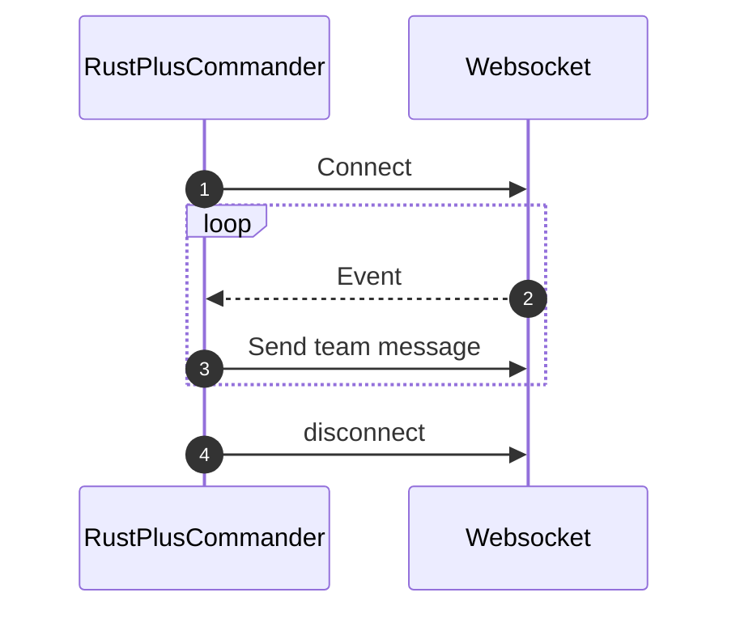

- [About](#about)
	- [How it works](#how-it-works)
	- [Requirements](#requirements)
	- [Running](#running)
	- [Usage](#usage)

# About

RustPlus Commander is a small Python app that allows you to control smart devices in Rust using the team chat, as well as query various server info.
It is built on top of [Rust+.py](https://rplus.ollieee.xyz)

## How it works

RustPlus Commander connects to the WebSocket on your Rust server, and continously exchanges messages with it.



## Requirements

- Python 3.6+
- SQLite
- A Steam account (and of course a copy of Rust)
- Be part of an active Team

You will need to set these environment variables:

- `RUST_SERVER_IP`: hostname or IP address of the target Rust server
- `RUST_SERVER_PORT`: Rust+ server port, `28079` by default, you can find it in the FCM notification payload, see below
- `STEAM_ID`: your Steam user ID
- `RUST_PLAYER_TOKEN`: token used for authenticating you with Rust servers, read below
- `RESP_PREFIX`: set custom prefix for messages sent by the commander in chat

How to get your Rust player token: <https://github.com/liamcottle/rustplus.js#using-the-command-line-tool>

## Running

```bash
pip install -r requirements.txt
python main.py
```

## Usage

In the team chat (either in game or in the Rust+ app), type:

```
!ping
!register somelight <entityid>
!turn_on somelight
```

`entityid` is a unique ID of every entity on the server. It can easily be found by interacting with one (e.g. hitting it) and checking `combatlog` using the F1 console.
The entities are persisted in a local SQLite DB, which will always be recreated if it is missing.

Full list of commands:

- `!ping` pings the Commander, if succesful will respond with a pong
- `!register <name> <entity_id>` - registers a device with a human `name` that has entity ID `entity_id`, no spaces in names allowed
- `!turn_on <name>` - turns on a device with name `name`
- `!turn_off <name>` - turns off a device with name `name`
- `!list_devices` - list all registered devices
- `!players` - shows the current number of online players
- `!time` - prints the current server time
- `!whoami` - get information about yourself
